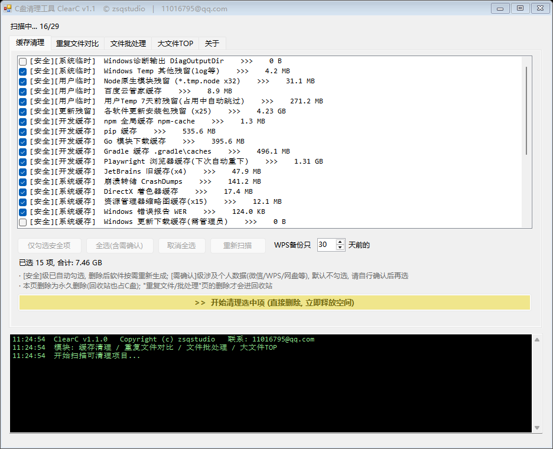
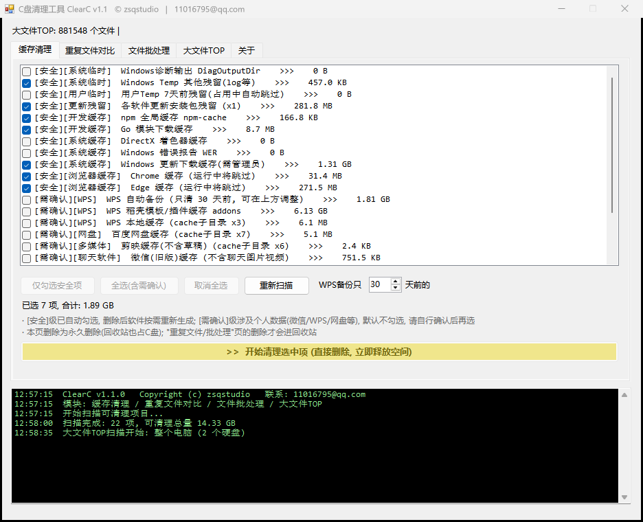
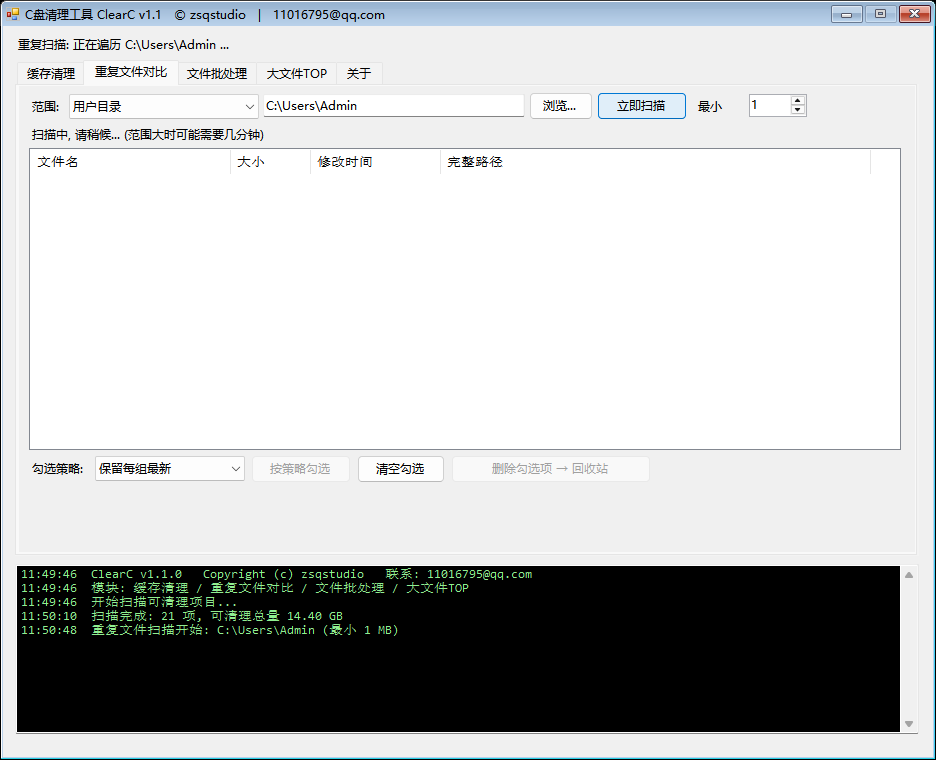

<div align="center">

# 🧹 ClearC

**C 盘又红了？60 秒找到该删的东西。**

零依赖 · 单文件 · Windows 自带编译器一条命令构建


-68217A?style=flat-square&logo=csharp)

</div>

<p align="center">
  
</p>

---

## 😫 你是不是也这样

- C 盘天天飘红，**又不知道到底是什么占的**
- 清理软件全家桶比垃圾本身还占地方，还弹广告
- 想找个「小而干净、拷走就能用」的工具 —— 找不到

**ClearC 就是为此而生**：一个约 60KB 的单文件 exe，不装运行时、不联网、不驻留后台，扫完即走。

---

## ✨ 五大功能，图文速览

### 🧹 缓存清理 — 22+ 类垃圾一键识别

系统临时 / 更新残留 / 开发缓存（npm · gradle · pip · go）/ 浏览器缓存 / 资源管理器缩略图 / WPS 备份 / 网盘·微信缓存……
按 **「安全 / 需确认」** 分级：安全级默认勾选、删了会自动重建；涉及个人数据的默认不勾，你自己拍板。

<p align="center">
  
</p>

### 📊 大文件 TOP — 空间大户一眼现形

**范围下拉选「整个电脑（所有硬盘）」的瞬间，扫描自动开始** —— 不用再点任何按钮。扫完列出 TOP 50 大文件 + TOP 20 大文件夹，`hiberfil.sys`、`pagefile.sys` 这些隐藏大户无处遁形。

<p align="center">
  
</p>

### 🔍 重复文件对比 — 按内容找重，策略勾选

按文件**内容**分组比对（不是只看文件名），一键按策略勾选：每组保留最新 / 最旧 / 路径最短……删错的文件躺在**回收站**里，随时反悔。

<p align="center">
  
</p>

### 📦 文件批处理 — 条件筛选，批量删/移

按 **类型 + 大小 + 修改日期** 组合筛选（如：`*.zip` 且 >100MB 且 半年未动），批量删除（进回收站）或批量移动到其他盘归档。

### ℹ️ 关于 — 版本与版权

---

## 🛡️ 安全设计

| 设计 | 说明 |
|---|---|
| **分级勾选** | 安全级自动勾选；需确认级（微信/WPS/网盘）默认不选 |
| **两种删除** | 缓存页直接删除立即释放空间；重复/批处理页走**回收站**可反悔 |
| **占用跳过** | 正在被占用的文件自动跳过，不使用强制手段 |
| **跳过链接** | 遍历时跳过符号链接/junction，防死循环不误删 |
| **全程日志** | 每次扫描/删除都留痕，可导出核对 |

---

## 🚀 快速开始

1. 从 [**Releases**](../../releases) 下载 `ClearC.exe`（约 60KB）
2. 双击运行（清理系统目录建议右键 → 以管理员身份运行）
3. 范围下拉选一个 → 自动开扫 → 勾选 → 清理 ✅

## 🔨 从源码构建（不用装任何东西）

整个工具就一个 `ClearC.cs`，Windows 自带的 C# 编译器就能编：

```bat
build.bat
```

或手动执行：

```bat
C:\Windows\Microsoft.NET\Framework64\v4.0.30319\csc.exe ^
  /nologo /target:winexe /platform:anycpu /codepage:65001 /out:ClearC.exe ^
  /r:System.dll /r:System.Core.dll /r:System.Drawing.dll ^
  /r:System.Windows.Forms.dll /r:Microsoft.VisualBasic.dll ClearC.cs
```

> 语法刻意停留在 **C# 5**，就是为了兼容所有 Windows 自带的 .NET Framework 4.0+ 编译器 —— 十年前的 Win7 也能编。

---

## ⭐ 觉得好用？

点个 **Star** 让更多 C 盘飘红的人看到它 · [提 Issue](../../issues) 反馈问题或建议新清理规则

---

## ⚠️ 免责声明

清理工具会删除文件：请先确认勾选项再执行，重要数据提前备份。使用本工具造成的任何数据损失，作者不承担责任。

<div align="center">

---

**ClearC** · v1.1.0 · Copyright (c) 2026 **zsqstudio** · 11016795@qq.com

</div>
